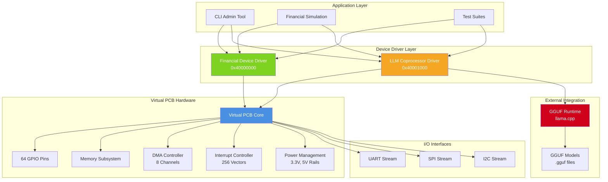
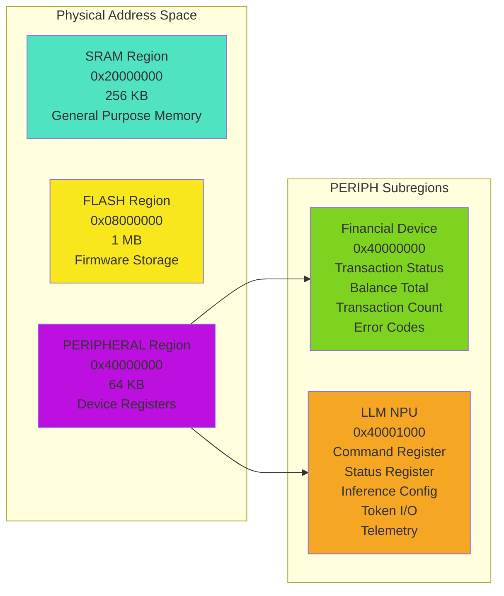
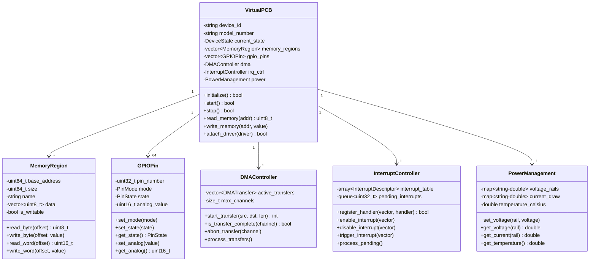
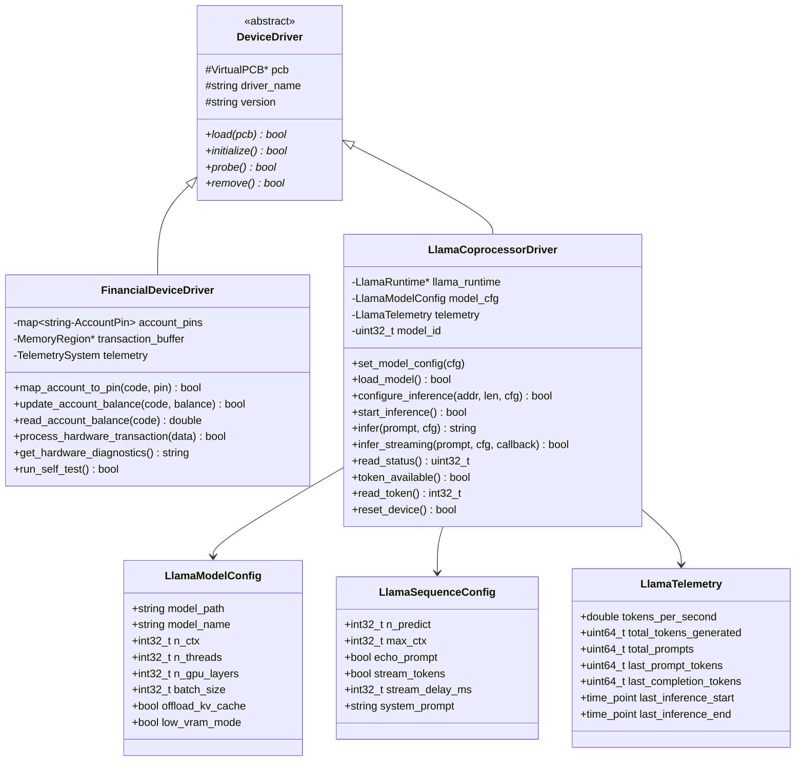
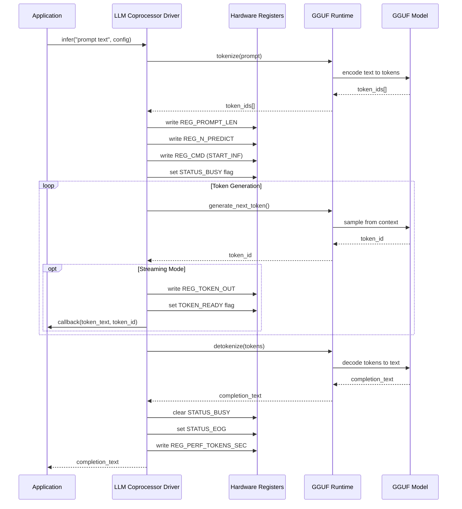
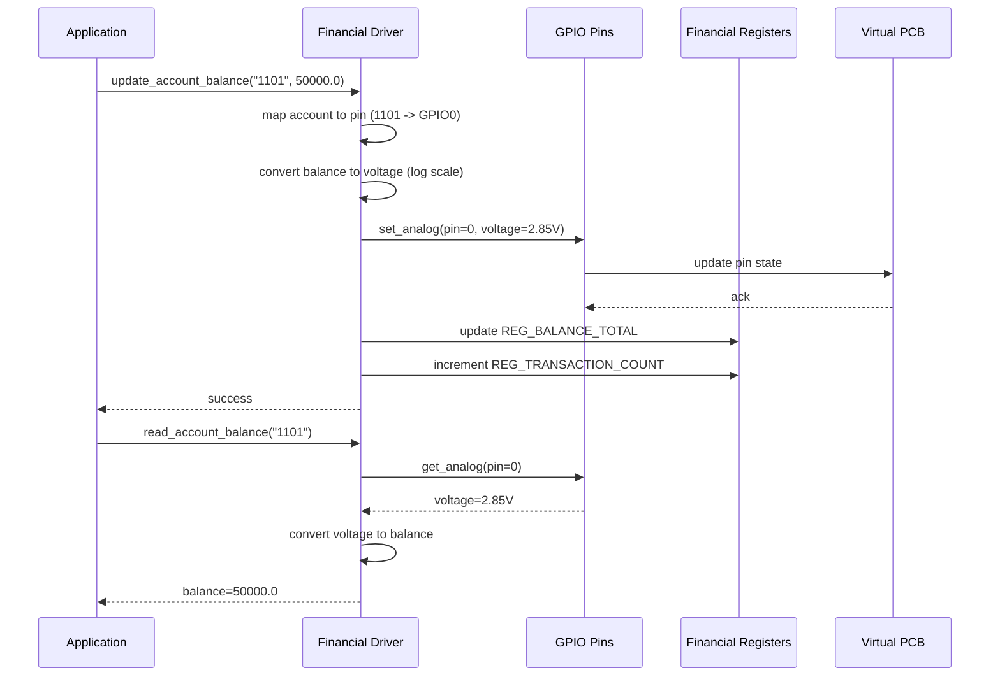
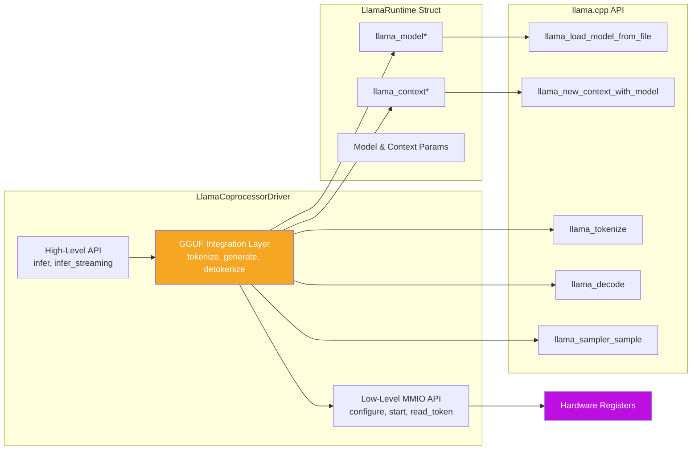
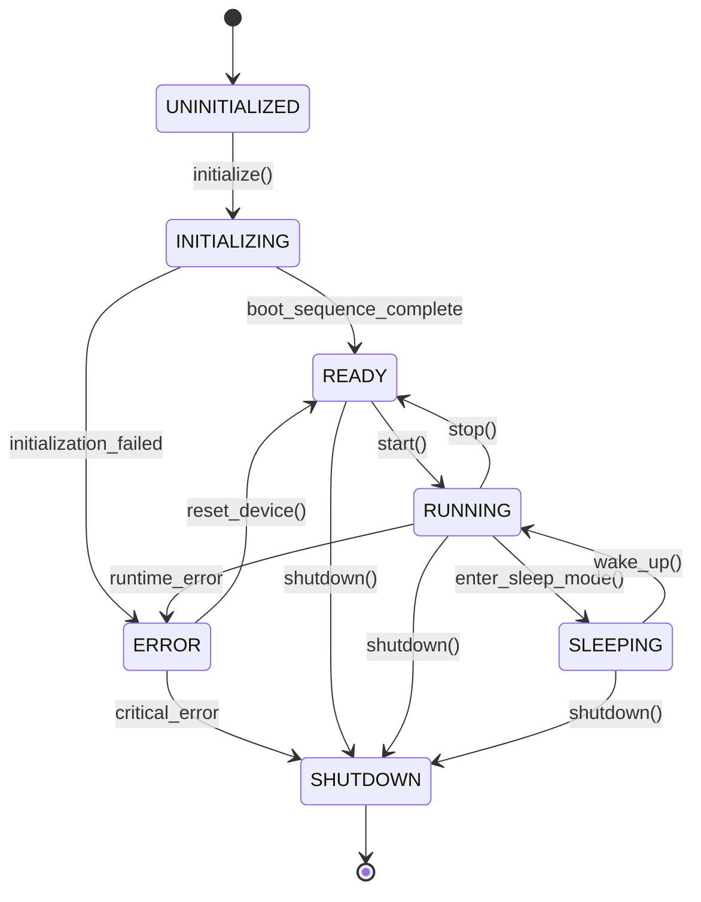
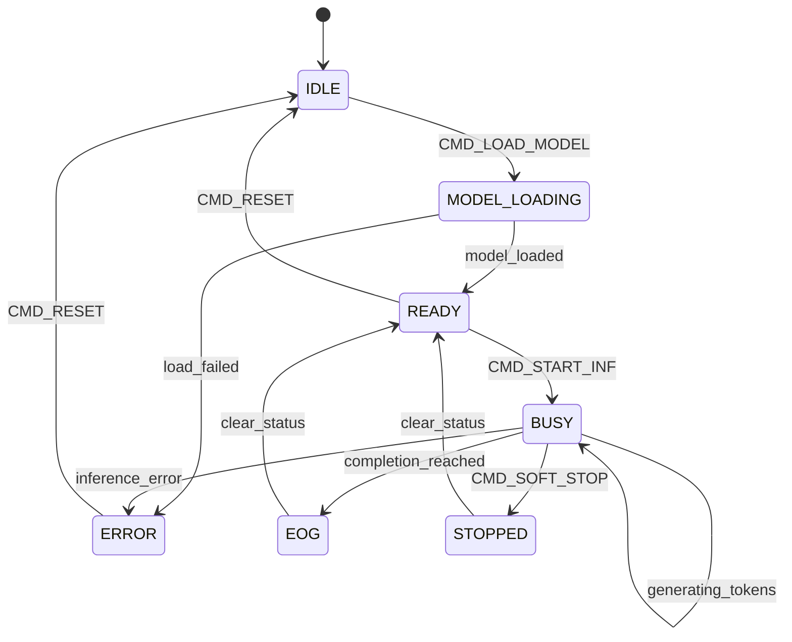
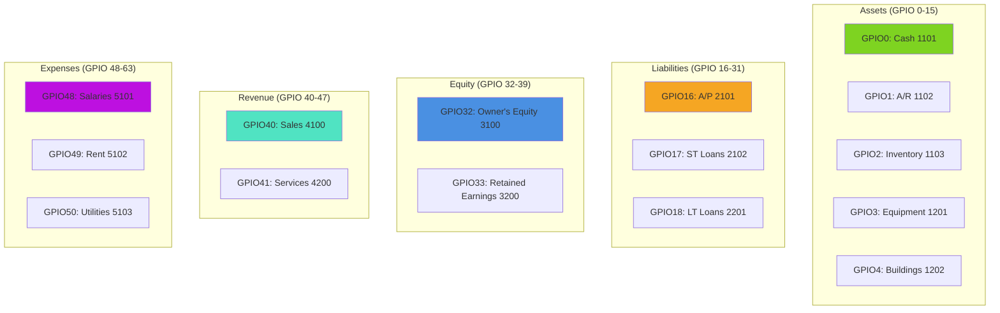

# NPU - Neural Processing Unit Coprocessor Architecture

## Executive Summary

The NPU (Neural Processing Unit) is a hardware-first abstraction framework that models GGUF-backed Large Language Model (LLM) inference as memory-mapped peripheral devices within a virtual Printed Circuit Board (PCB) architecture. This unique approach treats LLMs as hardware coprocessors with MMIO (Memory-Mapped I/O) registers, DMA controllers, and interrupt systems, enabling novel approaches to financial computation where accounting operations are modeled as electrical signals flowing through circuits.

### Key Architectural Principles

1. **Hardware-First Design**: LLM inference treated as peripheral device operations
2. **Memory-Mapped Interface**: All control through MMIO registers
3. **Virtual PCB Abstraction**: Complete simulation of physical hardware device
4. **Financial Circuit Modeling**: Accounts mapped to GPIO pins, transactions as signals
5. **Telemetry Integration**: Performance metrics exposed through hardware registers

## System Architecture Overview

### High-Level System Components



## Memory Architecture

### Memory Map Layout



### LLM NPU Register Layout (0x40001000 - 0x4000102F)

| Offset | Register Name | Description | Access |
|--------|--------------|-------------|--------|
| 0x00 | REG_CMD | Command register (reset, load, start, stop) | R/W |
| 0x04 | REG_STATUS | Status flags (idle, busy, EOG, error, ready) | R |
| 0x08 | REG_PROMPT_ADDR | SRAM address of prompt buffer | W |
| 0x0C | REG_PROMPT_LEN | Prompt length in bytes | W |
| 0x10 | REG_N_PREDICT | Number of tokens to generate | W |
| 0x14 | REG_TOKEN_OUT | Output token register | R |
| 0x18 | REG_TOKEN_READY | Token ready flag | R |
| 0x1C | REG_MODEL_ID | Loaded model identifier | R |
| 0x20 | REG_CTX_USED | Context size currently used | R |
| 0x24 | REG_ERROR_CODE | Hardware error code | R |
| 0x28 | REG_PERF_TOKENS_SEC | Performance counter (tokens/sec) | R |

### Financial Device Register Layout (0x40000000 - 0x4000000F)

| Offset | Register Name | Description | Access |
|--------|--------------|-------------|--------|
| 0x00 | REG_TRANSACTION_STATUS | Transaction processing status | R |
| 0x04 | REG_BALANCE_TOTAL | Total balance across all accounts | R |
| 0x08 | REG_TRANSACTION_COUNT | Number of transactions processed | R |
| 0x0C | REG_ERROR_CODE | Financial operation error codes | R |

## Component Architecture

### Virtual PCB Core



### Device Driver Architecture



## Data Flow Architecture

### LLM Inference Pipeline



### Financial Transaction Pipeline



## Integration Architecture

### External System Boundaries

```mermaid
graph TB
    subgraph "NPU System"
        VirtualPCB[Virtual PCB]
        FinDriver[Financial Driver]
        LLMDriver[LLM Driver]
    end
    
    subgraph "External Runtime"
        GGUF[GGUF Runtime<br/>llama.cpp]
        Tokenizer[Tokenizer]
        Sampler[Token Sampler]
    end
    
    subgraph "External Data"
        Models[GGUF Model Files<br/>.gguf]
        ChartAccts[Chart of Accounts<br/>JSON]
    end
    
    subgraph "External I/O"
        UART_Dev[/dev/ttyUSB0<br/>UART Device]
        SPI_Dev[/dev/spidev0.0<br/>SPI Device]
        I2C_Dev[/dev/i2c-1<br/>I2C Device]
    end
    
    LLMDriver --> GGUF
    GGUF --> Tokenizer
    GGUF --> Sampler
    GGUF --> Models
    
    FinDriver --> ChartAccts
    
    VirtualPCB --> UART_Dev
    VirtualPCB --> SPI_Dev
    VirtualPCB --> I2C_Dev
    
    style GGUF fill:#d0021b,color:#fff
    style Models fill:#f5a623,color:#fff
    style ChartAccts fill:#7ed321,color:#fff
```

### GGUF Runtime Integration



## State Machine Architecture

### Virtual PCB Device States



### LLM Inference States



## Performance Characteristics

### Virtual Hardware Performance

| Component | Metric | Value |
|-----------|--------|-------|
| GPIO Pins | Pin operation latency | < 1 µs |
| Memory Access | Read/Write latency | ~10 ns |
| DMA Transfer | Simulated bandwidth | 1 GB/s |
| Interrupt | Latency | < 1 µs |
| Device Update | Cycle time | 1 ms (configurable) |

### LLM Coprocessor Performance

| Metric | Description | Notes |
|--------|-------------|-------|
| Tokenization | Word-based (mock) or subword (llama.cpp) | Depends on implementation |
| Generation Speed | Model and hardware dependent | Real-time tracking via REG_PERF_TOKENS_SEC |
| Telemetry Accuracy | Timestamp-based measurement | High precision |
| Status Tracking | Hardware state machine | IDLE→BUSY→EOG transitions |
| Token Counting | Precise token-level accounting | Per-inference and cumulative |

## GPIO Pin Allocation

### Financial Account Mapping



### Balance-to-Voltage Conversion

Account balances are mapped to analog voltages using a logarithmic scale:
- **Voltage Range**: 0V - 3.3V
- **ADC Resolution**: 12-bit (0-4095)
- **Mapping Formula**: `voltage = log10(balance + 1) / 6.0 * 3.3`
- **Example**: $50,000 → log₁₀(50001) ≈ 4.70 → 2.59V

## Technology Stack

### Core Technologies

| Category | Technology | Version | Purpose |
|----------|-----------|---------|---------|
| Language | C++ | C++17 | Core implementation |
| Build System | CMake | 3.10+ | Build configuration |
| Threading | pthread | POSIX | Concurrency support |
| LLM Runtime | llama.cpp | Latest | GGUF model inference |
| Model Format | GGUF | - | Model file format |

### Build Targets

| Target | Description | Dependencies |
|--------|-------------|--------------|
| llama-device-admin | Interactive admin CLI | Virtual device, both drivers |
| llama-financial-sim | Financial simulation demo | llama.cpp, common |
| test-virtual-device | Virtual device tests | Virtual device, both drivers |
| test-financial-logic | Financial logic tests | - |
| test-gguf-integration | GGUF integration tests | Virtual device, LLM driver |
| demo-virtual-device | Simple device demo | Virtual device, financial driver |

## Design Patterns

### Hardware Abstraction Pattern

The NPU uses a layered hardware abstraction:
1. **Physical Layer**: VirtualPCB simulates physical hardware
2. **Register Layer**: Memory-mapped I/O for device control
3. **Driver Layer**: Device-specific drivers (Financial, LLM)
4. **API Layer**: High-level convenience APIs for applications

### Command-Status Pattern

All hardware operations follow a command-status pattern:
1. Write command to REG_CMD
2. Monitor REG_STATUS for completion
3. Check REG_ERROR_CODE for errors
4. Read results from data registers

### Telemetry Pattern

Performance metrics are collected at multiple levels:
1. **Hardware Registers**: REG_PERF_TOKENS_SEC, REG_CTX_USED
2. **Driver Telemetry**: LlamaTelemetry struct with detailed metrics
3. **System Telemetry**: TelemetrySystem with metric aggregation

## Security Considerations

### Memory Protection

- Memory regions have configurable write protection
- FLASH region is typically read-only after firmware load
- PERIPH region has register-level access control

### Error Handling

- Hardware error codes in REG_ERROR_CODE
- Status flags indicate error conditions
- Graceful degradation on failures
- Diagnostic output for troubleshooting

### Resource Limits

- DMA limited to 8 concurrent channels
- Interrupt vectors limited to 256
- GPIO pins limited to 64
- Memory regions have fixed sizes

## Future Extensions

### Planned Enhancements

1. **Real llama.cpp Integration**: Replace mock with actual library
2. **KV-Cache Management**: Map KV-cache to SRAM for persistence
3. **GPU Offloading**: Add GPU layer control via registers
4. **Interrupt Support**: Implement TOKEN_READY interrupt handling
5. **Model Hot-Swapping**: Dynamic model loading/unloading
6. **Batch Inference**: Process multiple prompts simultaneously
7. **LoRA Adapters**: Support fine-tuned model loading

### Extensibility Points

- **Custom Device Drivers**: Inherit from DeviceDriver base class
- **Custom I/O Streams**: Implement IOStream interface
- **Custom Memory Regions**: Add new memory regions to VirtualPCB
- **Custom Interrupts**: Register new interrupt handlers
- **Custom Telemetry**: Add metrics to TelemetrySystem

## References

### Documentation

- [README.md](../README.md) - Main project documentation
- [IMPLEMENTATION.md](../IMPLEMENTATION.md) - Implementation summary
- [fhp/VIRTUAL_DEVICE_README.md](../fhp/VIRTUAL_DEVICE_README.md) - Virtual device guide
- [fhp/GGUF_INTEGRATION.md](../fhp/GGUF_INTEGRATION.md) - GGUF integration guide

### Source Code

- [virtual-device.h](../fhp/virtual-device.h) - Virtual PCB header
- [virtual-device.cpp](../fhp/virtual-device.cpp) - Virtual PCB implementation
- [llama-coprocessor-driver.h](../fhp/llama-coprocessor-driver.h) - LLM driver header
- [llama-coprocessor-driver.cpp](../fhp/llama-coprocessor-driver.cpp) - LLM driver implementation
- [financial-device-driver.h](../fhp/financial-device-driver.h) - Financial driver header
- [financial-device-driver.cpp](../fhp/financial-device-driver.cpp) - Financial driver implementation

---

**Document Version**: 1.0  
**Last Updated**: 2025-12-03  
**Repository**: https://github.com/o9nn/npu
